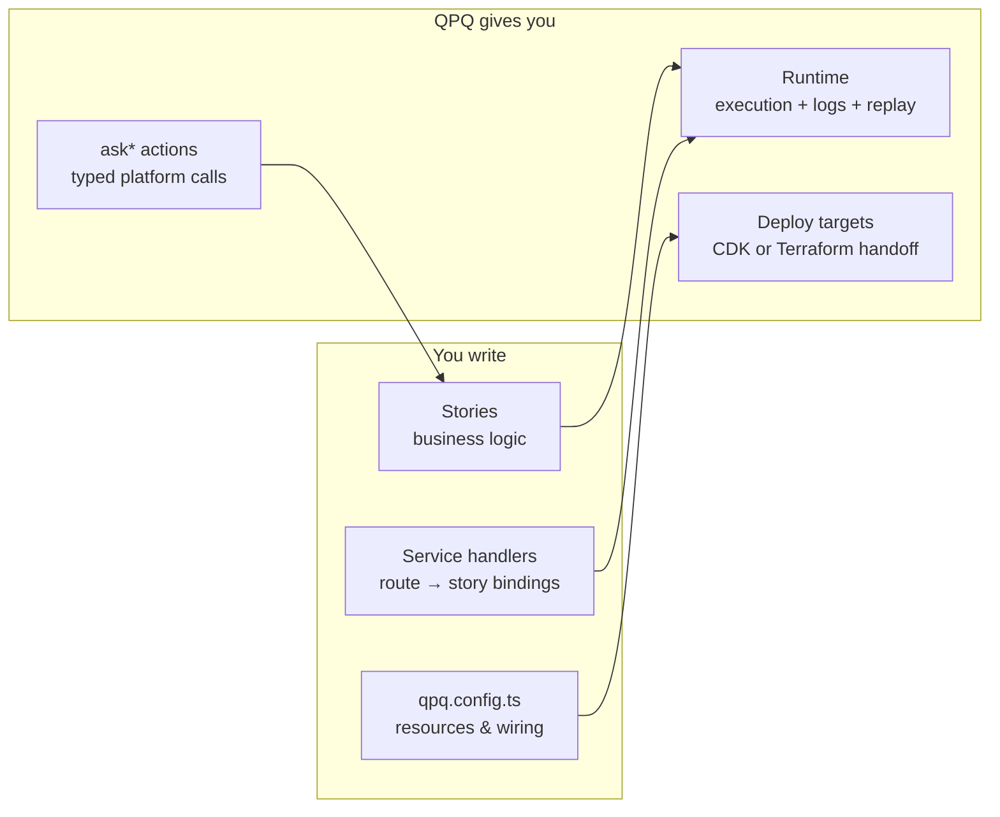
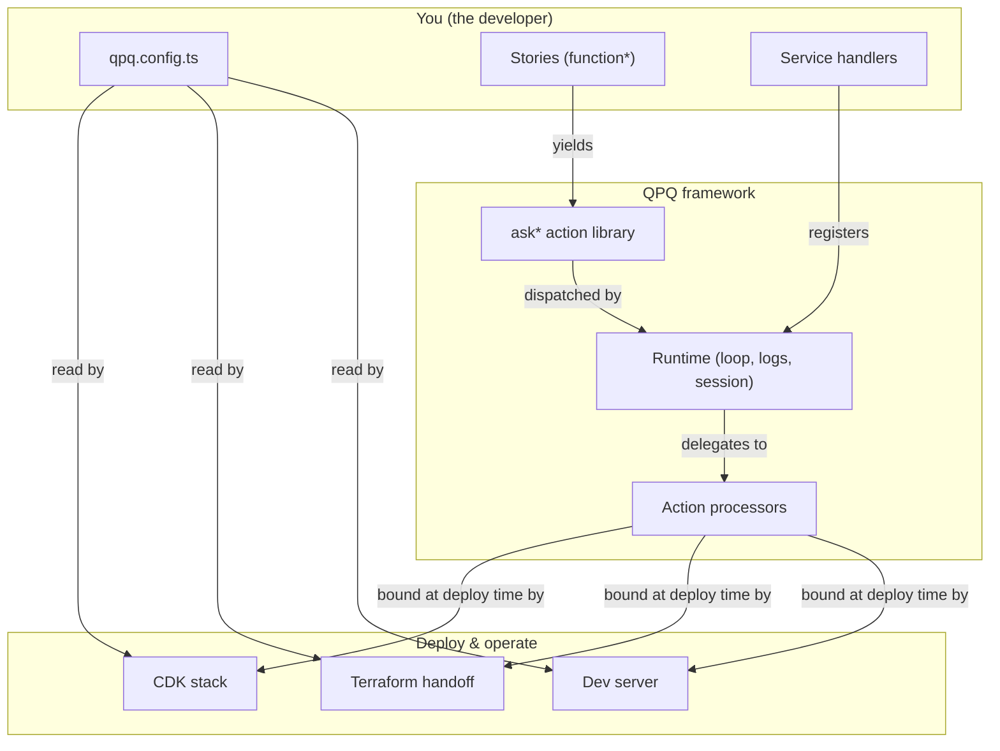

# Developer Concepts

This page is the high-level mental model of QuidProQuo (QPQ) from the perspective of an **application developer** — the engineer writing the code that ships features to users.

It complements two neighbouring pages:

- [Core Concepts](./core-concepts.md) — a focused dive into the four building blocks (actions, stories, processors, runtime).
- [Architecture Overview](./architecture-overview.md) — the full architectural detail, including logging, context propagation, and platform adapters.

If you only have ten minutes, read this page first. It is the developer-facing contract: **what you write, what QPQ gives you back, and the boundary between the two**.

---

## What QPQ asks from you

As a developer, you are responsible for three artifacts. Everything else is provided by the framework.



### 1. `qpq.config.ts` — your application's resource manifest

A single TypeScript file that declares the resources your app needs: key-value stores, storage drives, queues, event buses, APIs, scheduled tasks, user directories, secrets, parameters. Each entry is a typed `setting` object.

```typescript
// src/qpq.config.ts (shape)
export const config = defineQpqConfig({
  name: 'orders-app',
  settings: [
    { type: 'kvs',              name: 'orders',  partitionKey: 'orderId' },
    { type: 'storage-drive',    name: 'invoices' },
    { type: 'queue',            name: 'fulfilment' },
    { type: 'service-function', name: 'api',     runtime: 'nodejs20.x' },
    { type: 'api',              name: 'public',
      routes: [{ path: '/orders', method: 'POST', function: 'api' }] },
  ],
});
```

You never write provider SDK calls (no `S3Client`, no `DynamoDBClient`). The config describes the resource; QPQ — or DevOps, depending on the deploy target — creates it.

### 2. Stories — your business logic

A **story** is a `function*` generator that composes work by yielding `ask*` actions. Stories are pure: they hold no SDK references, no I/O, no time, no randomness — every external effect goes through a `yield*`.

```typescript
import { askKeyValueStoreGet, askKeyValueStoreUpsert, askGuidNew, askDateNow } from 'quidproquo-core';

export function* createOrderStory(customerId: string, items: Item[]) {
  const orderId   = yield* askGuidNew();
  const createdAt = yield* askDateNow();
  const order     = { orderId, customerId, items, createdAt };

  yield* askKeyValueStoreUpsert('orders', order);
  return order;
}
```

That purity is what makes the rest of the framework possible: deterministic tests, full execution replay, platform portability.

### 3. Service handlers — wiring stories to routes and events

A handler is a thin file that binds an inbound trigger (HTTP route, queue message, schedule, event subscription) to a story. The webserver package exposes the binding patterns; the handler itself rarely contains business logic.

```typescript
// src/services/api/createOrder.ts
export const handler = bindToHttpRoute(createOrderStory, (req) => [
  req.userId,
  req.body.items,
]);
```

---

## What QPQ gives you back

In return for those three artifacts, QPQ provides a complete runtime contract.

### The `ask*` library — platform-agnostic verbs

For every external effect — file I/O, key-value access, secrets, HTTP calls, queues, events, AI, time, GUIDs — there is a typed `ask*` generator. You always write the same verb regardless of where the app runs.

```typescript
const profile = yield* askFileReadTextContents('users', `${id}/profile.json`);
const value   = yield* askKeyValueStoreGet<User>('users', id);
const token   = yield* askConfigGetSecret('stripe-key');
const now     = yield* askDateNow();
```

The catalogue of verbs lives in [`quidproquo-core/src/actions`](./api/index.md). Adding a new verb is a framework-level change; using one is a one-line story addition.

### The runtime — execution, logging, replay

When a story runs, the runtime:

1. Drives the generator loop, dispatching each yielded action to its processor.
2. Captures every step — input, output, error, timing — in a `StoryResult` history.
3. Threads a `StorySession` through every call so correlation IDs, auth tokens, and context values propagate without parameter passing.
4. Makes the entire execution replayable: feed a saved `StoryResult` back into `qpqExecuteLog` and reproduce the run bit-for-bit, with optional action overrides for testing.

You don't construct the runtime in production code — the platform adapter does. You write stories and let the runtime do the work.

### Deploy targets — pick your handoff

Your `qpq.config.ts` is the input to two interchangeable deploy paths:

| Path | What it does | Owns the cloud resources |
| --- | --- | --- |
| **AWS CDK** (`quidproquo-deploy-awscdk`) | Synthesises CloudFormation from your config. The app team runs `cdk deploy`. | App team |
| **Terraform handoff** (`quidproquo-deploy-terraform`) | Dumps `qpq.config.json` and emits Terraform `module` calls against a versioned DevOps module library. DevOps runs `terraform apply`. | DevOps team |

Both paths read the **same** `qpq.config.ts`. Switching from one to the other does not require touching stories or service handlers. See [`docs/devops-handoff.md`](https://github.com/jeffory/quidproquo/blob/develop/docs/devops-handoff.md) for the Terraform contract.

### Local development — same code, no cloud

`quidproquo-dev-server` provides a local runtime with in-memory replacements for every cloud resource your config declares. The same story that reads from S3 in production reads from a local directory locally; the same KVS story hits an in-memory map. No mocks, no fixtures, no environment-conditional code.

```bash
cd my-qpq-app && npx qpq-dev-server
```

### Testing — assert on the action stream

`quidproquo-testing` lets you assert directly on the actions a story yields, in order, without running a runtime:

```typescript
expectGenerator(createOrderStory('cust-1', [{ sku: 'A' }]))
  .toYield(askGuidNew()).andReturn('order-123')
  .toYield(askDateNow()).andReturn('2026-05-13T00:00:00Z')
  .toYield(askKeyValueStoreUpsert('orders', expect.anything()))
  .toReturn({ orderId: 'order-123', customerId: 'cust-1', items: [{ sku: 'A' }], createdAt: '2026-05-13T00:00:00Z' });
```

Tests do not need network, processes, or a database. They are pure data assertions on the generator output.

---

## The contract, in one paragraph

You declare resources in `qpq.config.ts`. You write business logic as pure generator stories that only touch the world through `ask*` actions. You bind stories to triggers in thin service handlers. In return, QPQ gives you a typed library of platform-agnostic verbs, a runtime that logs and replays every execution, a deploy pipeline that runs the same config on either AWS CDK or a Terraform-handoff DevOps pipeline, and a local dev server plus a test harness that need no cloud at all. The boundary is sharp: anything platform-specific lives in a processor, not in your code.

---

## How the layers fit together



The vertical axis is **your code → framework → operations**. Each layer only sees the one immediately below it. That is what lets you swap CDK for Terraform, AWS for local, or production for a replay — without rewriting stories.

---

## Where to go next

- [Getting Started](./getting-started.md) — concrete project setup and your first story.
- [Core Concepts](./core-concepts.md) — the four building blocks in depth.
- [Architecture Overview](./architecture-overview.md) — full architectural detail, context, observability.
- [Tutorials](./tutorials/rest-api.md) — end-to-end walkthroughs for REST APIs, file storage, auth, queues, schedules, and WebSockets.
- [Packages](./packages/index.md) — what each `quidproquo-*` package provides.
